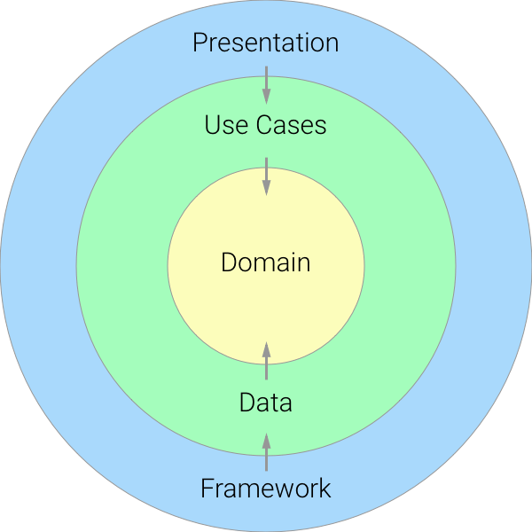
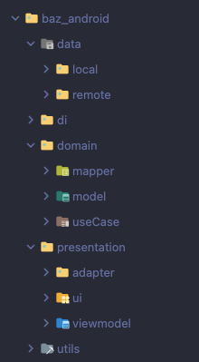

# Cryptocurrency Project

<video width="640" height="480" controls>
  <source src="./final_app.mp4" type="video/mp4">
  Your browser does not support the video tag.
</video>

## Introducción
A sample app that display a _"Order books"_, An order book is a record of all the buy and sell orders that have been placed for a particular cryptocurrency pair on a cryptocurrency exchange market.
The order book is typically divided into two sections: one for buy orders and one for sell orders. The orders are recorded in chronological order, from the oldest to the newest. Each order indicates the price and quantity of the cryptocurrency that the buyer or seller wants to buy or sell.
The order book is important because it provides traders with information about the liquidity of the market, as well as the current prices and buying and selling trends for the cryptocurrency in question. Traders can use this information to make informed decisions about when to buy or sell a cryptocurrency and at what price."

## Proyect Structure
The purpose of this project to illustrate the usage of MVVM architecture design pattern that follow the best practices of Clean Architecture using the following technology stack.

1. Clean Architecture
2. MVVM
3. Hilt (Dependency Injection)
4. Live Data, Flow
5. Room Database
6. Retrofit
7. Okhttp3
8. RxJava3
9. Unit Testing (Espresso), Mockito
10. AndroidX
11. Glide
12. JetPack Libraries
13. View Binding
14. Coroutines
15. Navigation Component




It was decided to use the clean architecture pattern due to its focus on separating the responsibilities of the code in different capabilities and levels of abstraction, with the aim of creating scalable, maintainable and flexible systems, the way to implement it for this project is as follows:

1. Presentation layer: Responsible for displaying the user interface and managing user interaction with the app, using MVVM
2. Domain layer: This layer contains the business logic of the application. Contains business rules and entity classes
3. Data layer: This layer is responsible for obtaining and storing the application data, including access to the local database and remote APIs

For the consume of services, it was decided to use the retrofit library due to its advantages compared to other libraries, among which are its easy integration, the use of its annotations to facilitate the construction of requests and the interpretation of responses, ease of data conversion with the help of the Gson library, its compatibility with OkHttp and its ease of use.

To facilitate data collection through the use of asynchronous programming, it was decided to use LiveData to update the user interface safely and in real time, since in addition to these two advantages it offers us, it helps us by combining it with the data cycle. lifetime of the activity or fragment, which means that the UI update can only be guaranteed when the activity or fragment is in active state.

For obtaining and issuing data, it was decided to use Flow since it allows us to transform and process the data asynchronously.

And as an extra example of its use, it was decided to use RxJava instead of flow for the consumption of one of the services, to see the difference between using this library compared to others

## Libraries

```
lifecycle_version = "2.5.1"
retrofit_version = "2.9.0"
gson_version = "2.10.1"
rx_version = "3.0.0"
materialDesigne_version = "1.2.0-alpha02"
hilt_version = "2.44"
nav_version = "2.5.3"
splash_version = "1.0.0"
glide_version = "4.14.2"
okhttp_version = "5.0.0-alpha.2"
room_version = "2.4.3"
espresso_version = "3.5.1"
junit_version = "1.1.3"
mockk_version = "1.12.2"
coroutines_version = "1.6.4"
```

```
// Material Design
implementation 'com.google.android.material:material:1.8.0'
implementation "com.google.android.material:material:$materialDesigne_version"

// SPLASH SCREEN
implementation "androidx.core:core-splashscreen:$splash_version"

// RETROFIT
implementation "com.squareup.retrofit2:retrofit:$retrofit_version"
implementation "com.squareup.retrofit2:converter-gson:$retrofit_version"
implementation "com.squareup.retrofit2:adapter-rxjava3:$retrofit_version"
implementation "com.google.code.gson:gson:$gson_version"

// RXJAVA
implementation "io.reactivex.rxjava3:rxandroid:$rx_version"
implementation "io.reactivex.rxjava3:rxjava:$rx_version"

// OKHTTP
implementation "com.squareup.okhttp3:okhttp:$okhttp_version"
implementation "com.squareup.okhttp3:logging-interceptor:$okhttp_version"
implementation "com.squareup.okhttp3:okhttp-urlconnection:4.4.1"

// VIEWMODEL
implementation "androidx.lifecycle:lifecycle-viewmodel-ktx:$lifecycle_version"
implementation "androidx.lifecycle:lifecycle-livedata-ktx:$lifecycle_version"
implementation "androidx.lifecycle:lifecycle-viewmodel-savedstate:$lifecycle_version"
implementation "org.jetbrains.kotlinx:kotlinx-coroutines-core:$coroutines_version"

// HILT
implementation "com.google.dagger:hilt-android:$hilt_version"
kapt "com.google.dagger:hilt-compiler:$hilt_version"

// NAVIGATION
implementation "androidx.navigation:navigation-fragment-ktx:$nav_version"
implementation "androidx.navigation:navigation-ui-ktx:$nav_version"

// Glide
implementation "com.github.bumptech.glide:glide:$glide_version"
kapt "com.github.bumptech.glide:compiler:$glide_version"

// ROOM
implementation "androidx.room:room-ktx:$room_version"
kapt "androidx.room:room-compiler:$room_version"

// TEST
testImplementation 'junit:junit:4.13.2'
testImplementation "io.mockk:mockk:$mockk_version"
testImplementation "org.mockito:mockito-inline:3.11.2"
testImplementation "androidx.arch.core:core-testing:2.2.0"
testImplementation "org.mockito.kotlin:mockito-kotlin:4.1.0"
testImplementation "org.jetbrains.kotlinx:kotlinx-coroutines-test:$coroutines_version"
androidTestImplementation 'androidx.test:core:1.5.0'
androidTestImplementation "androidx.test:runner:1.5.2"
androidTestImplementation "androidx.test.ext:junit:$junit_version"
androidTestImplementation "androidx.test.espresso:espresso-core:$espresso_version"
androidTestImplementation "androidx.test.espresso:espresso-contrib:$espresso_version"
androidTestImplementation "androidx.test.espresso:espresso-accessibility:$espresso_version"


